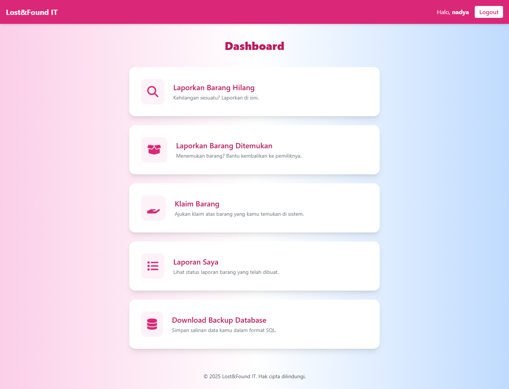
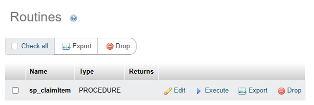
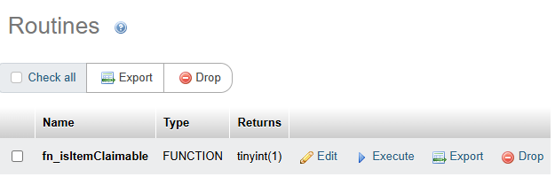

# 🎒 Lost&Found IT 

Lost&Found IT adalah aplikasi web untuk pelaporan dan klaim barang hilang atau ditemukan di lingkungan IT. Aplikasi ini dirancang untuk memastikan proses pelaporan dan klaim dilakukan secara aman, transparan, dan terkonsolidasi, dengan memanfaatkan stored procedure, trigger, transaction, dan stored function di tingkat database. Sistem ini juga memperhatikan validasi peran dan status barang secara otomatis demi menjaga integritas data.



## 📌 Detail Konsep

### 🧠 Stored Procedure

Stored procedure digunakan untuk mengelola proses klaim barang secara aman dan terstruktur. Dengan menyimpan prosedur ini di sisi database, sistem menjamin konsistensi eksekusi terlepas dari bagaimana aplikasi frontend atau backend memanggilnya.



Prosedur penting:

#### `sp_claimItem(p_user_id, p_item_id)`

```php
$stmt = $pdo->prepare("CALL sp_claimItem(?, ?)");
$stmt->execute([$user_id, $item_id]);
```

Tugas prosedur:

* Memastikan user bukan admin
* Memvalidasi status barang (harus ‘available’)
* Memastikan user belum pernah mengklaim barang yang sama
* Menyimpan klaim baru dengan status `pending`
* Mengubah status barang menjadi `claimed`
* Menyimpan log aktivitas

Penerapan logika bisnis langsung di database menjamin semua aturan tetap berlaku walau aplikasi frontend berubah.


### 🚨 Trigger

Trigger `trg_after_claim` dijalankan secara otomatis **setelah klaim disimpan**. Fungsinya mirip sistem otomatisasi yang menjaga agar status barang selalu sinkron dengan aksi pengguna.


#### `trg_after_claim`

```sql
CREATE TRIGGER trg_after_claim 
AFTER INSERT ON claims 
FOR EACH ROW 
BEGIN
    UPDATE items 
    SET status = 'claimed' 
    WHERE item_id = NEW.item_id;
END
```

Peran utama trigger ini:

* Menjaga konsistensi status barang
* Mencegah status barang tidak berubah meskipun klaim sudah masuk
* Menghindari kebutuhan pembaruan manual oleh aplikasi

Dengan trigger ini, sistem menjaga integritas data bahkan jika ada error atau kelalaian di sisi aplikasi.


### 🔄 Transaction

Transaksi digunakan untuk menjamin integritas penuh ketika pengguna melakukan klaim. Proses klaim bukan hanya satu langkah, melainkan gabungan dari berbagai validasi dan penyimpanan data. Jika salah satu tahap gagal, seluruh proses dibatalkan.


#### Implementasi transaksi di `claim.php`

```php
try {
    $check = $pdo->prepare("SELECT fn_isItemClaimable(?) as is_claimable");
    $check->execute([$item_id]);
    $is_claimable = $check->fetchColumn();

    if (!$is_claimable) {
        throw new Exception("Barang tidak tersedia untuk diklaim.");
    }

    $stmt = $pdo->prepare("CALL sp_claimItem(?, ?)");
    $stmt->execute([$user_id, $item_id]);

    $success = "Klaim berhasil dikirim.";
} catch (Exception $e) {
    $error = $e->getMessage();
}
```

Dengan pendekatan ini:

* Validasi dan klaim hanya terjadi jika semua kondisi terpenuhi
* Menghindari data parsial (klaim tercatat tetapi status belum berubah, dll)
* Konsisten dengan prinsip *atomicity* dalam sistem data terdistribusi


### 📺 Stored Function

Stored function digunakan untuk melakukan *read-only check* terhadap kelayakan klaim suatu barang. Seperti indikator sistem, function ini tidak mengubah data, tapi berperan penting dalam proses validasi.




#### `fn_isItemClaimable(p_item_id)`

```php
$check = $pdo->prepare("SELECT fn_isItemClaimable(?) AS is_claimable");
$check->execute([$item_id]);
```

#### Di database:

```sql
CREATE FUNCTION fn_isItemClaimable(p_item_id INT)
RETURNS TINYINT(1) DETERMINISTIC
BEGIN
    DECLARE claimable BOOLEAN;
    SELECT status = 'available' INTO claimable
    FROM items
    WHERE item_id = p_item_id;
    RETURN IFNULL(claimable, FALSE);
END
```

Fungsi ini:

* Mengecek apakah barang masih tersedia
* Menghindari duplikasi logika di berbagai tempat
* Bisa dipanggil oleh aplikasi dan prosedur sekaligus

Fungsi seperti ini mencerminkan pemisahan logika bisnis yang baik, dan cocok diterapkan pada sistem yang melibatkan banyak titik akses seperti web, mobile, dan API.


### 🔐 Sistem Autentikasi

Autentikasi menjadi pintu utama akses sistem. Sistem menggunakan password hashing dan session handling untuk menjaga keamanan data pengguna.


#### `login.php`

```php
$stmt = $pdo->prepare("SELECT user_id, name, email, role FROM users WHERE email = ?");
$stmt->execute([$email]);
$user = $stmt->fetch();

if ($user && password_verify($password, $user['password'])) {
    $_SESSION['user_id'] = $user['user_id'];
    $_SESSION['name'] = $user['name'];
    $_SESSION['role'] = $user['role'];
}
```

Fitur autentikasi:

* Validasi user berdasarkan email dan password
* Password disimpan dengan `password_hash()`
* Login aman menggunakan prepared statements
* Session menyimpan identitas user dan role
* Akses dibedakan berdasarkan role (`admin`, `user`)


### 💾 Backup Otomatis *(opsional)*

Untuk pengembangan lanjutan, sistem dapat diintegrasikan dengan proses backup otomatis menggunakan `mysqldump`. File backup dapat dijadwalkan dengan task scheduler dan disimpan di direktori `storage/backups`.

```php
<?php
$date = date('Y-m-d_H-i-s');
$backupFile = __DIR__ . "/storage/backups/backup_$date.sql";
$command = "mysqldump -u root lostfound_it > $backupFile";
exec($command);
```


## 🧩 Relevansi Proyek dengan Pemrosesan Data Terdistribusi

Sistem Lost\&Found IT dikembangkan dengan memperhatikan prinsip-prinsip pemrosesan data terdistribusi:

* **Konsistensi**
  Semua logika kritis dipusatkan di stored procedure dan function dalam database untuk menghindari konflik data.

* **Reliabilitas**
  Trigger dan transaction menjamin tidak ada proses yang dijalankan setengah jalan. Jika gagal, sistem rollback.

* **Integritas**
  Semua akses ke data dijaga dengan validasi di level database, sehingga sistem tetap valid walau dipanggil dari banyak sumber (frontend, API, dll).
